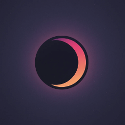
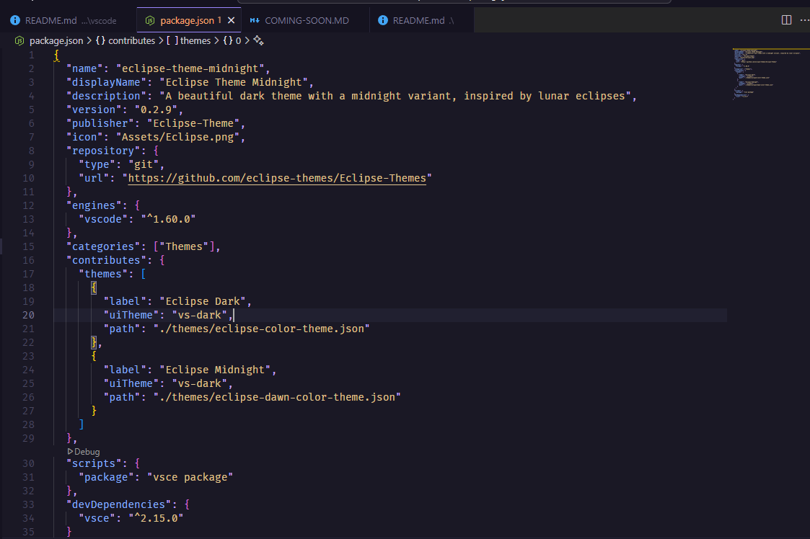

# 🌑 Eclipse Theme

A beautiful dark theme inspired by lunar eclipses, designed for developers who appreciate a sleek, modern interface with excellent contrast and readability.

## 🌟 Theme Preview

<div align="center">
  
  <p><em>Eclipse Theme Logo</em></p>
  
  
  <p><em>Eclipse Theme in Action</em></p>
</div>


## 🎨 Brand Guidelines

### Color Palette

Eclipse Theme offers carefully selected color palettes designed to reduce eye strain during long coding sessions while maintaining visual appeal.

<details open>
<summary>🌑 Eclipse Dark Theme</summary>

#### Core Colors

| Color | Name | Hex | Usage |
|-------|------|-----|-------|
|  | Dark Background | `#1e1e2e` | Primary background |
|  | Dark Surface | `#181825` | Secondary background |
|  | Text | `#cdd6f4` | Primary text |
|  | Subtext | `#a6adc8` | Secondary text |

#### Accent Colors

| Color | Name | Hex | Usage |
|-------|------|-----|-------|
|  | Lavender | `#cba6f7` | Primary accent |
|  | Blue | `#89b4fa` | Secondary accent |

</details>

<details>
<summary>🌙 Eclipse Midnight Theme</summary>

#### Core Colors

| Color | Name | Hex | Usage |
|-------|------|-----|-------|
|  | Midnight Background | `#0f0e15` | Primary background |
|  | Deep Space | `#0a0910` | Secondary background |
|  | Moonlight | `#e2e2e2` | Primary text |
|  | Starlight | `#a8a8c3` | Secondary text |

#### Accent Colors

| Color | Name | Hex | Usage |
|-------|------|-----|-------|
|  | Cosmic Purple | `#bb9af7` | Primary accent |
|  | Nebula Blue | `#7aa2f7` | Secondary accent |

</details>

<details>

### Usage Guidelines

- **Backgrounds**: Use Eclipse Dark (`#0f0e15`) as the primary background and Eclipse Midnight (`#0a0910`) for contrast elements
- **Text**: Use Moonlight (`#e2e2e2`) for primary text and Starlight (`#a8a8c3`) for secondary/disabled text
- **Accents**: Use Cosmic Purple (`#bb9af7`) for primary actions and Nebula Blue (`#7aa2f7`) for secondary actions
- **Contrast**: Ensure text has a minimum contrast ratio of 4.5:1 against background colors

### CSS Variables

For web projects, you can use these CSS variables:

```css
:root {
  --eclipse-dark: #0f0e15;
  --eclipse-midnight: #0a0910;
  --moonlight: #e2e2e2;
  --starlight: #a8a8c3;
  --cosmic-purple: #bb9af7;
  --nebula-blue: #7aa2f7;
}
```

## 📦 Applications

### VS Code Theme
- [Install from Marketplace](https://marketplace.visualstudio.com/items?itemName=Eclipse-Theme.eclipse-theme-midnight)
- [GitHub Repository](https://github.com/eclipse-themes/Eclipse-Themes/tree/main/apps/vscode)

## 📝 License

Eclipse Theme is licensed under the MIT License. See [LICENSE](LICENSE) for more information.


## 📄 License

This project is licensed under the [MIT License](LICENSE).
