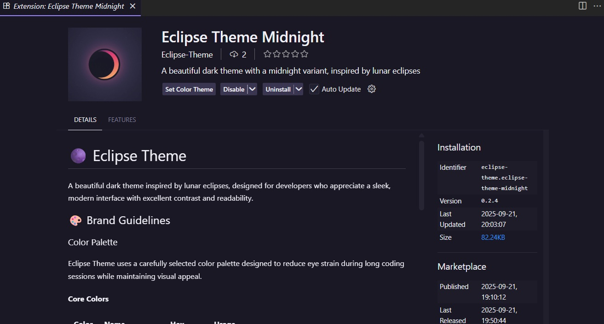

  <h1>
    
    Eclipse Midnight
  </h1>

A beautiful dark theme inspired by lunar eclipses, designed for people who appreciate a sleek, modern interface with excellent contrast and readability.

## 🌟 Theme Previews

💻 Editor Preview

  
  
<em>Eclipse Midnight in Action</em>

📦 Extension Page

  
  
<em>Eclipse Midnight Extension Page</em>

## 🎨 Brand & Color Guidelines

For detailed color specifications, naming conventions, and usage guidelines, please refer to our comprehensive [Brand Guidelines](BRAND_GUIDELINES.md). This includes the complete color palette, terminal colors, and implementation details for maintaining visual consistency across all Eclipse Midnight themes.

## 📦 Applications

All Eclipse Midnight themes are organized in the [`apps`](https://github.com/eclipse-themes/Eclipse-Themes/tree/main/apps) directory, with each application having its own subdirectory.

## Fira Code Font
- License: SIL Open Font License 1.1
- Copyright (c) 2014, The Fira Code Project Authors
- Download & info: [Fira Code GitHub](https://github.com/tonsky/FiraCode)

## Material Icon Theme
- License: MIT License (as distributed via VS Code Marketplace)
- Author: Philipp Kief
- Install & info: [Material Icon Theme Marketplace](https://marketplace.visualstudio.com/items?itemName=PKief.material-icon-theme)

## 📝 License

Eclipse Midnight is licensed under the MIT License. See [LICENSE](LICENSE.md) for more information.
