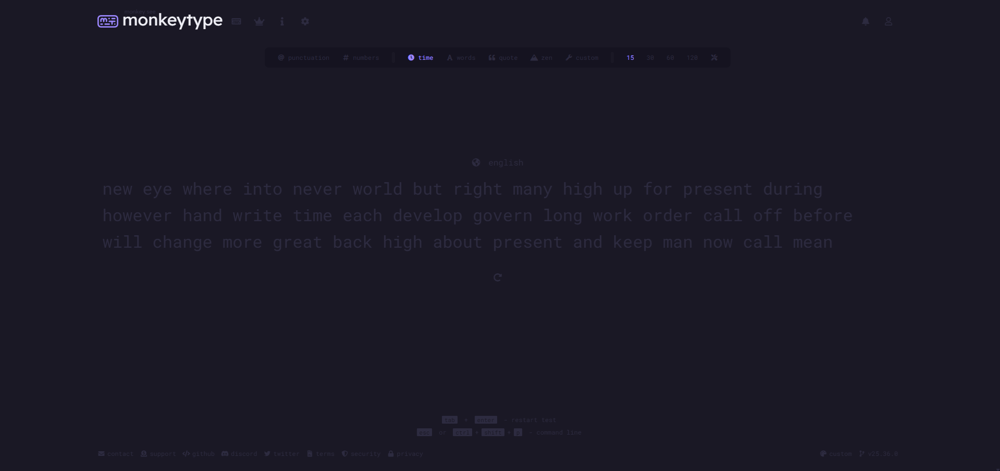

# Eclipse Midnight Theme for MonkeyType

A sleek, dark theme for [MonkeyType](https://monkeytype.com/) that follows the Eclipse Midnight design language.

## 🌟 Features

- **Eye-friendly dark theme** - Reduces eye strain during long typing sessions
- **High contrast** - Improved readability in all lighting conditions
- **Brand-consistent colors** - Matches the Eclipse Midnight color palette
- **Responsive design** - Looks great on all screen sizes

## 🖥️ Preview

## 🚀 Installation

### Quick Install
Click the button below to apply the theme directly:

